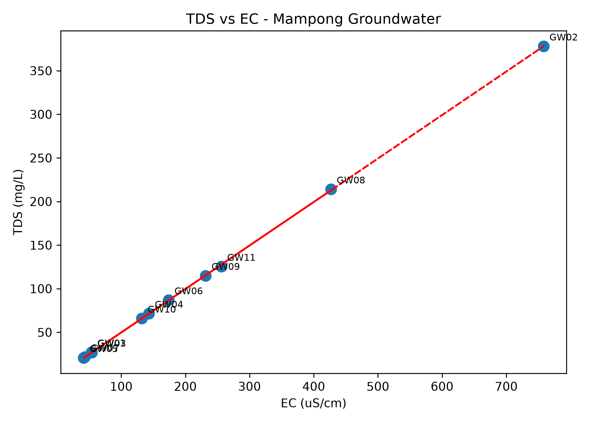
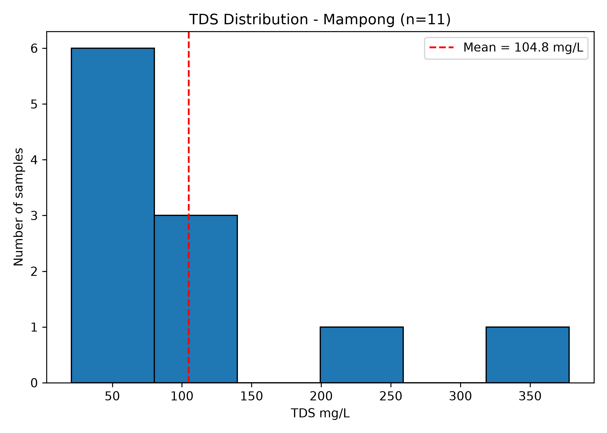

## Thesis Context
This repository is an independent computational extension of data collected for my BSc Final Year Thesis: "Hydrogeochemical Assessment of Groundwater in Asante Mampong, Ghana" (USTED, August,2026). Thesis = experimental field & lab work. This repo = independent Python analysis for graduate studies in Computational Chemistry.

# Mampong Groundwater Quality Assessment

Assessment of groundwater quality in Mampong based on 10 samples GW01 to GW10. Compared with WHO standards.

## Results

### pH Analysis
All samples acidic below WHO limit 6.5. Range 5.3 - 6.3 needs treatment.

### TDS Analysis
All within WHO 500 mg/L. GW02 highest 383 mg/L, 70% low <100 mg/L.

### EC Analysis
All within WHO 1500 uS/cm limit.

### Turbidity Analysis
Measures water clarity. WHO limit 5 NTU.

### Correlation TDS vs EC
Positive correlation confirmed. Higher dissolved solids = higher conductivity. GW02 is outlier.

### Distribution
TDS distribution shows most samples clean.

## Key Findings
- pH: FAILED WHO - acidic
- TDS, EC, Turbidity: PASSED WHO
- GW02 is most mineralized sample

## Conclusion
Water is low mineralization but requires pH correction before drinking.
