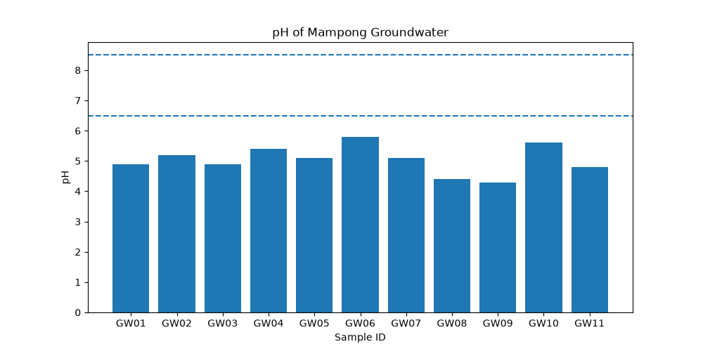
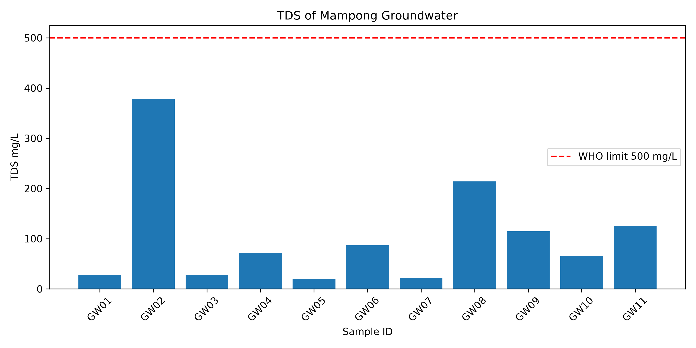
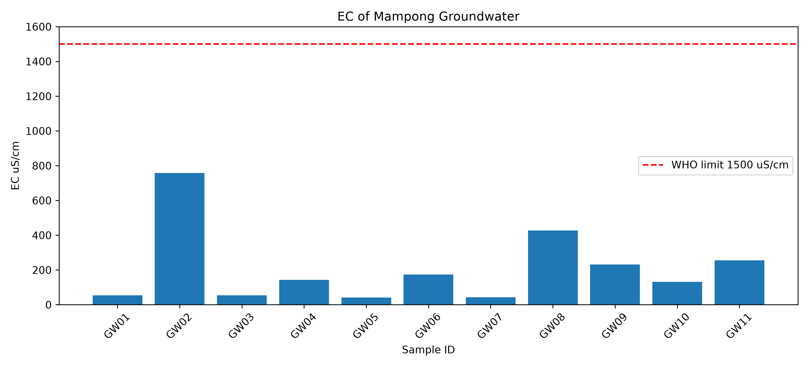
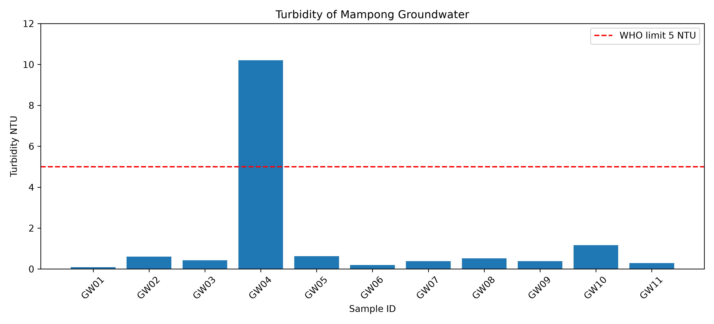

# Mampong Groundwater Quality Assessment

Assessment of groundwater quality in Mampong based on 10 samples GW01 to GW10.

## Results

### pH Chart
All samples below WHO limit 6.5, water is acidic.

### TDS Chart
All samples below WHO limit 500 mg/L, safe for drinking.

### EC Chart
All samples below WHO limit 1500 uS/cm.

### Turbidity Chart
Only GW04 exceeds WHO limit 5 NTU.

## Conclusion
Water is acidic and GW04 has turbidity problem.
